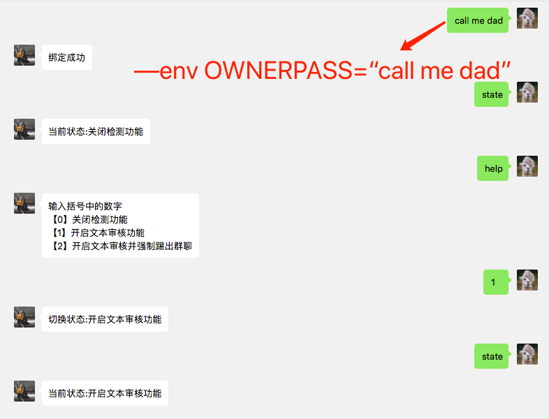
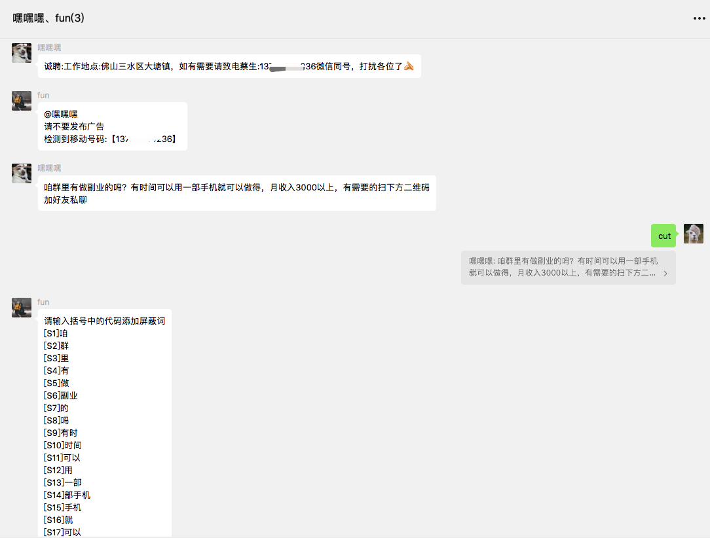
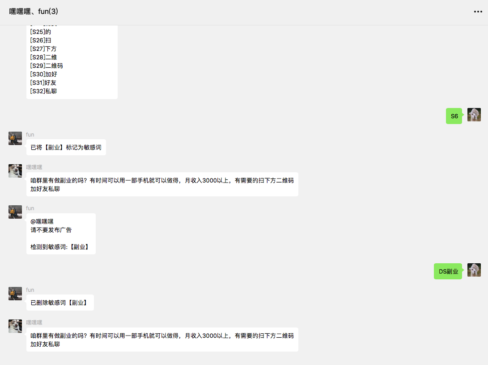

# wechat-reviewer


## 使用

可在本地运行或使用docker运行

* **本地运行**

  * ```shell
    git clone https://github.com/hcolde/wechat-reviewer.git
    ```

  * 在config/config.json修改token等信息

  * ```shell
    npm install ts-node typescript -g --registry=https://registry.npm.taobao.org
    ```

  * ```shell
    npm install --registry=https://registry.npm.taobao.org
    ```

  * ```shell
    ts-node bot.js
    ```

* **docker运行**

  * ```shell
    sudo docker pull registry.cn-shenzhen.aliyuncs.com/colde/wechat-reviewer:1.0
    ```

  * ```shell
    sudo docker run -itd --name robot \
    --env OWNERPASS=绑定主人的口令 \
    --env TOKEN=你申请的token \
    --env MAILHOST=邮箱服务器地址 \
    --env MAILPORT=端口 \
    --env MAILUSER=邮箱 \
    --env MAILPASS=授权码 \
    registry.cn-shenzhen.aliyuncs.com/colde/wechat-reviewer:1.0
    ```

  * 若不填写邮箱信息，登录二维码发送到邮箱功能不生效，不影响程序正常运行，二维码可通过访问https://api.qrserver.com/v1/create-qr-code/?data=xxxx查看，具体URL可通过日志查看:`sudo docker logs robot`

## 介绍

* **功能**

- [x] 绑定主人
- [x] 登录二维码发送到邮箱
- [x] 
- [x] 文本广告检测
- [x] 自定义敏感词（增加/删除）
- [ ] 图片广告检测

检测的方式仅仅是通过正则识别文本中是否包含微信号，手机号等信息，因为发广告肯定要留下联系方式:)


* **使用**

  

  

  